# Think Twice - Game Theory Platform v0.3

A web platform for conducting game theory experiments.

-  **Railway Deployment**: One-click deployment to Railway
-  **Admin Authentication**: JWT-based admin panel with secure login
-  **PostgreSQL**: Production database with proper connection pooling
-  **Better UX**: Leaderboard only on home page, cleaner game views
-  **Error Handling**: Comprehensive error handling and validation
-  **Security**: CORS configuration, environment variables, secure credentials

### Features
- **3 Games**: Two-Thirds Average, Horse Racing, Fish Pond
- **Admin Panel**: Protected game management and player administration
- **Leaderboard**: Real-time global scoring system
- **Responsive**: Works on desktop and mobile

---

## 🚀 Quick Deploy (5 Minutes)

### 1. Deploy Backend to Railway
```bash
1. Go to railway.app and sign up with GitHub
2. Click "New Project" → "Deploy from GitHub repo"
3. Select your repository
4. Railway auto-detects Python and deploys
5. Add PostgreSQL: Click "New" → "Database" → "PostgreSQL"
```

### 2. Configure Environment Variables
In Railway, set these variables:
```
ADMIN_USERNAME=admin
ADMIN_PASSWORD=your_secure_password
SECRET_KEY=your_32_char_random_string
FRONTEND_URL=https://your-frontend-url.com
```

### 3. Deploy Frontend to Vercel
```bash
1. Go to vercel.com and sign up with GitHub
2. Import your repository
3. Set root directory to: frontend
4. Deploy
```

### 4. Update Configuration
Update `script.js` with your Railway backend URL:
```javascript
const API_URL = 'https://your-backend.railway.app/api';
```

**📖 Full deployment guide**: See [RAILWAY_DEPLOYMENT.md](docs/RAILWAY_DEPLOYMENT.md)

---

## 🎮 How to Use

### For Participants

1. **Register**
   - Go to the frontend URL
   - Enter your name to register
   - Or select existing player

2. **Play Games**
   - Admin will start games
   - Follow on-screen instructions
   - Submit your moves
   - View results and leaderboard

### For Administrators

1. **Login**
   - Click "Admin Login" button
   - Username: `admin` (or your configured username)
   - Password: Your configured password

2. **Manage Games**
   - Start Two-Thirds game
   - Start Fish Pond game
   - Calculate results when ready

3. **Monitor**
   - View all players
   - See who hasn't submitted
   - Control game flow

---

## 🎯 Games Explained

### 1. Two-Thirds of the Average
**Concept**: Strategic thinking and level-k reasoning

**Rules**:
- Each player guesses a number (0-100)
- Winner is closest to 2/3 of the average
- Tests ability to predict others' reasoning

**Scoring**: Winner gets 10 points

**Admin Actions**:
- Start game
- Calculate results when all submitted

---

### 2. Horse Racing
**Concept**: Information gathering and deduction

**Rules**:
- 25 horses with hidden speeds
- Each round: select 5 horses to race
- Goal: Identify top 3 fastest in minimum rounds
- Individual player challenge

**Scoring**: 
- Base 50 points
- Minus 5 points per round used
- Minimum 10 points

**Strategy**: Efficient testing and elimination

---

### 3. Fish Pond
**Concept**: Tragedy of the commons

**Rules**:
- 100 fish in pond initially
- 5 rounds total
- Each round: catch 0-20 fish
- Pond regenerates 50% per round
- If overfished: pond collapses, game ends

**Scoring**: 1 point per fish caught

**Dilemma**: Individual gain vs. collective sustainability

**Admin Actions**:
- Start game with all registered players
- Calculate each round's results

---

## 🏗️ System Architecture & Data Flow

This platform uses a decoupled three-tier architecture configured for quick deployment to Vercel (Frontend) and Railway (Backend API & PostgreSQL database).

```mermaid
flowchart LR
  %% Style Definitions
  classDef frontend fill:#e0f2fe,stroke:#0284c7,stroke-width:2px,color:#0369a1,font-size:16px
  classDef backend fill:#d1fae5,stroke:#059669,stroke-width:2px,color:#065f46,font-size:16px
  classDef database fill:#f3e8ff,stroke:#7c3aed,stroke-width:2px,color:#5b21b6,font-size:16px,font-weight:bold
  classDef public_api fill:#ffedd5,stroke:#ea580c,stroke-width:2px,color:#c2410c,font-size:15px
  classDef admin_api fill:#fce7f3,stroke:#db2777,stroke-width:2px,color:#9d174d,font-size:15px

  %% FRONTEND TIER (Vercel)
  subgraph Frontend_App ["Frontend App (Vercel)"]
    UI_Player["Participant Interface<br/>(Registration, Game Play, Leaderboard)"]:::frontend
    UI_Admin["Admin Panel<br/>(JWT-protected Game & Player Controls)"]:::frontend
  end

  %% API ENDPOINTS TIER
  subgraph Public_Endpoints ["Public Endpoints"]
    Endpoint_Reg["POST /api/players<br/>(Register Player)"]:::public_api
    Endpoint_Submit["POST /api/games/{game}/submit<br/>(Submit Move)"]:::public_api
    Endpoint_Leaderboard["GET /api/leaderboard<br/>(Rankings)"]:::public_api
  end

  subgraph Admin_Endpoints ["Admin Endpoints (JWT Protected)"]
    Endpoint_Login["POST /api/auth/login<br/>(JWT Authentication)"]:::admin_api
    Endpoint_Start["POST /api/games/{game}/start<br/>(Start Game/Round)"]:::admin_api
    Endpoint_Calc["POST /api/games/{game}/calculate<br/>(Compute Results)"]:::admin_api
  end

  %% Connect Frontend to Endpoints
  UI_Player -->|Register| Endpoint_Reg
  UI_Player -->|Play Game| Endpoint_Submit
  UI_Player -->|View rankings| Endpoint_Leaderboard

  UI_Admin -->|Login with credentials| Endpoint_Login
  UI_Admin -->|Initialize Game| Endpoint_Start
  UI_Admin -->|Calculate scores| Endpoint_Calc

  %% BACKEND TIER (FastAPI on Railway)
  subgraph Backend_API ["Backend API (FastAPI on Railway)"]
    FastAPI["FastAPI App (main.py)"]:::backend
    JWTAuth["JWT Authenticator (auth.py)"]:::backend
    PydanticSchemas["Pydantic Validation (schemas.py)"]:::backend
    SQLAlchemy["SQLAlchemy ORM (database.py)"]:::backend

    subgraph Game_Logic ["Game Engines"]
      Logic_TwoThirds["Two-Thirds Average Logic<br/>(Guess closest to 2/3 of average)"]:::backend
      Logic_Horses["Horse Racing Simulation<br/>(Select 5 of 25 / Find Top 3)"]:::backend
      Logic_FishPond["Fish Pond Commons Dilemma<br/>(Catch 0-20 / Pond Regenerates 50%)"]:::backend
    end
  end

  %% Connect Endpoints to Backend Router
  Endpoint_Reg & Endpoint_Submit & Endpoint_Leaderboard --> FastAPI
  Endpoint_Login --> JWTAuth
  Endpoint_Start & Endpoint_Calc --> FastAPI
  JWTAuth -.->|Verify token| FastAPI

  FastAPI --> PydanticSchemas
  FastAPI <-->|Execute rules| Game_Logic
  FastAPI --> SQLAlchemy

  %% DATABASE TIER (PostgreSQL on Railway)
  subgraph Database_Tier ["Database Tier (PostgreSQL)"]
    Table_Player["Table: players<br/>(ID, Name, Total Score)"]:::database
    Table_Game["Table: game_sessions<br/>(Active state, Round count)"]:::database
    Table_Submission["Table: submissions<br/>(Chosen moves, Round scores)"]:::database
  end

  SQLAlchemy <-->|Connection Pool / CRUD| Database_Tier
```



---

## 📁 Project Structure

```
game-theory-v3/
├── backend/
│   ├── main.py              # FastAPI app with all endpoints
│   ├── auth.py              # JWT authentication
│   ├── database.py          # SQLAlchemy models
│   ├── schemas.py           # Pydantic validation
│   ├── config.py            # Configuration
│   ├── requirements.txt     # Python dependencies
│   ├── Procfile             # Railway config
│   └── .env.example         # Environment template
├── frontend/
│   ├── index.html           # Main HTML
│   ├── script.js            # Frontend logic
│   └── style.css            # Styling
└── docs/
    └── RAILWAY_DEPLOYMENT.md  # Full deployment guide
```

---

## 🔧 Local Development

### Prerequisites
- Python 3.11+
- Docker (for PostgreSQL)

### Setup

1. **Clone and Setup Backend**
```bash
cd backend
python -m venv venv
source venv/bin/activate  # On Windows: venv\Scripts\activate
pip install -r requirements.txt
cp .env.example .env
```

2. **Start PostgreSQL**
```bash
docker run --name game-db -e POSTGRES_PASSWORD=gamepass123 \
  -e POSTGRES_USER=gameuser -e POSTGRES_DB=game_theory_db \
  -p 5432:5432 -d postgres:15-alpine
```

3. **Run Backend**
```bash
uvicorn main:app --reload --host 0.0.0.0 --port 8000
```

4. **Open Frontend**
```bash
cd frontend
python -m http.server 3000
```

5. **Access**
- Frontend: http://localhost:3000
- Backend API: http://localhost:8000
- API Docs: http://localhost:8000/docs

---

## 📊 API Endpoints

### Public Endpoints
- `POST /api/players` - Register player
- `GET /api/players` - List all players
- `GET /api/leaderboard` - Get rankings
- `POST /api/games/{game}/submit` - Submit game move

### Admin Endpoints (Require Authentication)
- `POST /api/auth/login` - Admin login
- `POST /api/games/two-thirds/start` - Start Two-Thirds game
- `POST /api/games/two-thirds/{id}/calculate` - Calculate results
- `POST /api/games/fish-pond/start` - Start Fish Pond game
- `POST /api/games/fish-pond/{id}/calculate-round` - Calculate round
- `DELETE /api/players/{id}` - Delete player

**Full API Documentation**: Visit `/docs` on your backend URL

---

## 🐛 Troubleshooting

### "Database connection failed"
- Check PostgreSQL is running
- Verify DATABASE_URL in environment variables

### "CORS error"
- Update CORS_ORIGINS to include your frontend URL
- No trailing slashes in URLs

### "Admin login failed"
- Check ADMIN_USERNAME and ADMIN_PASSWORD
- Verify SECRET_KEY is set
- Check browser console for errors

### "502 Bad Gateway"
- Backend is starting (wait 30 seconds)
- Check Railway logs
- Verify environment variables

**More help**: See [RAILWAY_DEPLOYMENT.md](docs/RAILWAY_DEPLOYMENT.md)

---

## 📈 Monitoring

### Railway Dashboard
- View deployment logs
- Monitor resource usage
- Check database connections
- Restart services if needed

### Database Backup
1. Go to Railway PostgreSQL service
2. Click "Connect"
3. Use pg_dump to export data

---

## 🎓 Game Theory Concepts

### Two-Thirds Game
- Tests level-k reasoning
- Nash equilibrium: everyone guesses 0
- Real behavior: average often around 20-30

### Horse Racing
- Information search strategies
- Optimal algorithm: 7 races minimum
- Tests systematic elimination

### Fish Pond
- Tragedy of the commons
- Shows tension between individual and collective good
- Real-world applications: fishing, forestry, climate

---

## 📝 License

MIT License - Free for educational and research use

---

## 🙏 Credits

Built for conducting game theory experiments in educational settings.

**Technology Stack**:
- Backend: FastAPI, SQLAlchemy, PostgreSQL
- Frontend: Vanilla JavaScript, HTML, CSS
- Deployment: Railway, Vercel
- Authentication: JWT (python-jose)

---

## 📞 Support
- **Mail**: urgundeshantanu@gmail.com
- **Deployment Issues**: Check [RAILWAY_DEPLOYMENT.md](docs/RAILWAY_DEPLOYMENT.md)
- **API Questions**: Visit `/docs` endpoint
- **Game Rules**: See game descriptions above

---

**Ready to deploy? Follow [RAILWAY_DEPLOYMENT.md](docs/RAILWAY_DEPLOYMENT.md)**
