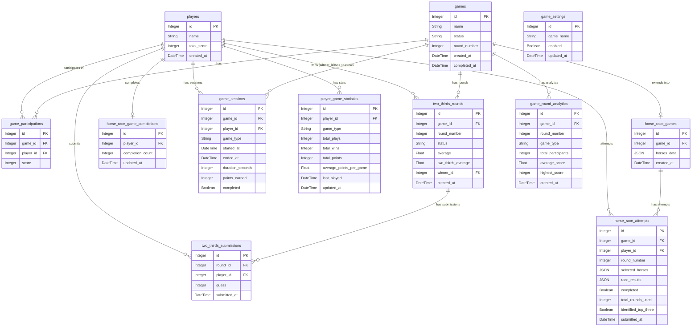

# Database Entity-Relationship Diagram

Here is the ER diagram representing the schema defined in `backend/database.py`.

```mermaid
---
id: 485e1107-30d1-4126-92d5-c65fdcfd17a7
---
erDiagram
    players ||--o{ game_participations : "participates in"
    players ||--o{ two_thirds_submissions : "submits"
    players ||--o{ horse_race_attempts : "attempts"
    players ||--o{ two_thirds_rounds : "wins (winner_id)"
    players ||--o| horse_race_game_completions : "completes"
    players ||--o{ game_sessions : "has sessions"
    players ||--o{ player_game_statistics : "has stats"

    games ||--o{ game_participations : "has"
    games ||--o{ two_thirds_rounds : "has rounds"
    games ||--o| horse_race_games : "extends into"
    games ||--o{ game_sessions : "has sessions"
    games ||--o{ game_round_analytics : "has analytics"

    two_thirds_rounds ||--o{ two_thirds_submissions : "has submissions"

    horse_race_games ||--o{ horse_race_attempts : "has attempts"

    players {
        Integer id PK
        String name
        Integer total_score
        DateTime created_at
    }

    games {
        Integer id PK
        String name
        String status
        Integer round_number
        DateTime created_at
        DateTime completed_at
    }

    game_settings {
        Integer id PK
        String game_name
        Boolean enabled
        DateTime updated_at
    }

    game_participations {
        Integer id PK
        Integer game_id FK
        Integer player_id FK
        Integer score
    }

    two_thirds_rounds {
        Integer id PK
        Integer game_id FK
        Integer round_number
        String status
        Float average
        Float two_thirds_average
        Integer winner_id FK
        DateTime created_at
    }

    two_thirds_submissions {
        Integer id PK
        Integer round_id FK
        Integer player_id FK
        Integer guess
        DateTime submitted_at
    }

    horse_race_games {
        Integer id PK
        Integer game_id FK
        JSON horses_data
        DateTime created_at
    }

    horse_race_attempts {
        Integer id PK
        Integer game_id FK
        Integer player_id FK
        Integer round_number
        JSON selected_horses
        JSON race_results
        Boolean completed
        Integer total_rounds_used
        Boolean identified_top_three
        DateTime submitted_at
    }

    horse_race_game_completions {
        Integer id PK
        Integer player_id FK
        Integer completion_count
        DateTime updated_at
    }

    game_sessions {
        Integer id PK
        Integer game_id FK
        Integer player_id FK
        String game_type
        DateTime started_at
        DateTime ended_at
        Integer duration_seconds
        Integer points_earned
        Boolean completed
    }

    game_round_analytics {
        Integer id PK
        Integer game_id FK
        Integer round_number
        String game_type
        Integer total_participants
        Float average_score
        Integer highest_score
        DateTime created_at
    }

    player_game_statistics {
        Integer id PK
        Integer player_id FK
        String game_type
        Integer total_plays
        Integer total_wins
        Integer total_points
        Float average_points_per_game
        DateTime last_played
        DateTime updated_at
    }
```
