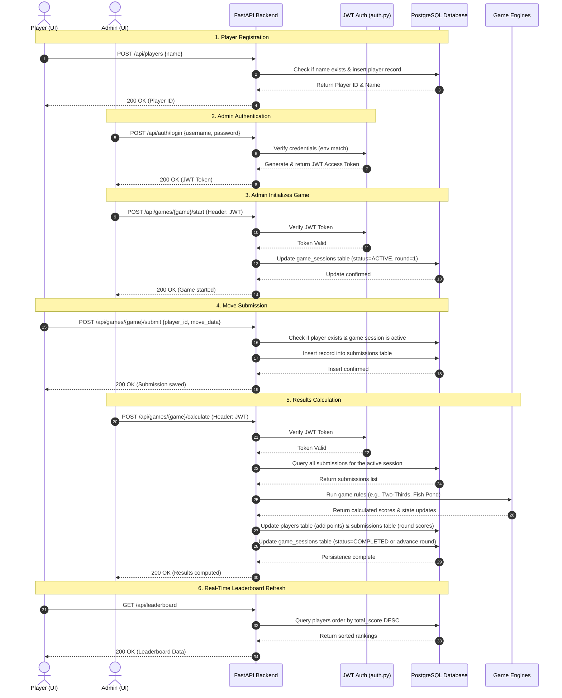

# Think Twice - End-to-End Data Path

This document outlines the end-to-end data flow and lifecycle of game sessions, participant actions, database persistence, and administrative controls within the **Think Twice** platform.

---

## 1. End-to-End Sequence Diagram

The following sequence diagram illustrates the lifecycle of a player registration, admin login, starting a game, submitting moves, calculating results, and refreshing the leaderboard.

---

## 2. Key Data Path Breakdown

### A. Participant Registration
*   **Path**: `POST /api/players`
*   **Payload**: `{"name": "Alice"}`
*   **Action**: Inserts a new row in the `players` table with `total_score = 0`. Returns the unique player ID to store in local storage on the client.

### B. Game Action Submission
*   **Path**: `POST /api/games/{game}/submit`
*   **Payload**: Contains the `player_id`, the active `session_id`, the `round_number`, and the game-specific action (e.g., a guess number from `0-100` for Two-Thirds, or fish count to catch `0-20` for Fish Pond).
*   **Action**: Validates the submission using Pydantic schemas and saves it in the database to prevent duplicate play.

### C. Admin Control & Calculations
*   **Path**: `POST /api/games/{game}/calculate`
*   **Authorization**: Bearer JWT Token
*   **Action**: The server fetches all submitted moves for the active round. It calls the corresponding game logic:
    *   **Two-Thirds Average Engine**: Calculates the average of all guesses, multiplies by `2/3`, finds the closest guess, and awards 10 points to the winner(s).
    *   **Fish Pond Engine**: Aggregates the total fish caught. Evaluates if the pond collapsed (>100 fish caught). If sustained, calculates remaining fish and regenerates the pond by 50% for the next round.
*   **Persistence**: Atomically updates the players' scores and marks submissions as calculated.
